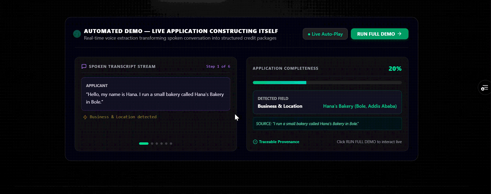
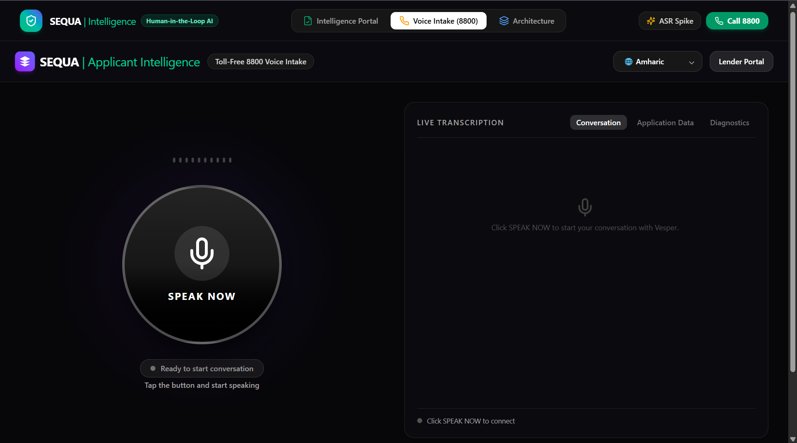

# Vesper.ai

> **Your voice. Your story. An honest funding application — no forms, no literacy required.**

[](https://opensource.org/licenses/MIT)
[]()
[]()
[]()
[]()

<p align="center">
  
</p>

Over 75% of informal micro-entrepreneurs in emerging markets lack smartphones and formal digital literacy, locking them out of financial capital. Vesper.ai breaks this barrier by turning standard 2G/PSTN voice calls into verified, audit-ready microfinance credit packages. Borrowers dial a toll-free number on basic feature phones, speak naturally in Amharic, Afaan Oromoo, or English, and our multimodal AI extracts 10 core underwriting fields bound strictly to verbatim spoken quotes—no hallucinations, no silent guessing, and zero forms.

---

## Demo

- **Toll-Free Telephony Simulator:** Built-in Nokia/2G interactive keypad in the web console (`8800`)

<p align="center">
  
</p>

<p align="center">
  
</p>

---

## The Problem

Traditional credit intake systems fail informal micro-enterprises at every step:

- **Form-First Assumption:** Existing digital loan applications mandate smartphones, internet connectivity, and reading/writing literacy in major global languages.
- **Intermediary Information Loss:** Loan officers and brokers informally translate or rephrase verbal stories, losing critical operational nuance or inadvertently distorting revenue figures.
- **AI Hallucination & Silent Guessing:** Standard LLM extraction pipelines routinely fabricate or assume missing data points (such as machinery or start dates) instead of flagging what was never actually stated.
- **Severe Underwriting Delays:** Manual field visits and physical paper intake take an average of 18 days per applicant, making small-ticket lending uneconomical for microfinance institutions (MFIs).

---

## The Solution — How It Works

Vesper provides an end-to-end bridge from analog telephony to institutional underwriting. A borrower simply dials into a toll-free number on any phone, conducts an interview with an AI voice agent in their native tongue, and the system produces a structured, quote-verified credit package with automated DSCR debt coverage calculation and an instant SMS feedback loop.

1. **Inbound Call & Language Selection:** Caller dials toll-free `8800` from any 2G phone. The interactive IVR menu prompts language choice (*1 for Amharic / አማርኛ, 2 for Afaan Oromoo, 3 for English*).
2. **Conversational Voice Interview:** The Voice Agent conducts an adaptive spoken intake covering 10 fundamental business indicators (enterprise name, trade sector, history, location, headcount, revenue, productive assets, funding purpose, amount requested, and job creation impact).
3. **Multimodal Gemini Extraction:** Gemini transcribes the audio dialect and maps details to structured JSON fields. Every extracted field is tagged with an explicit status (`applicant_stated` or `missing`) and tied directly to a verbatim quote.
4. **Deterministic Credit Grading:** The engine computes estimated cash flows, DSCR debt service coverage, and a creditworthiness tier (Grade A to D) without altering raw applicant statements.
5. **Lender Portal & SMS Dispatch:** MFI credit committee officers review the application, inspect audio and quote citations, and record loan approvals—automatically triggering a localized SMS confirmation back to the applicant's phone.

```mermaid
flowchart LR
    A[Caller on 2G Phone] -->|Dials Toll-Free 8800| B[IVR Gateway / Telephony SIP]
    B -->|Audio Stream & Dialect Selection| C[Gemini Multimodal Engine]
    C -->|Transcript & Honest Quote Extraction| D[10-Field Structured JSON]
    D -->|Deterministic Risk Scoring & DSCR| E[MFI Lender Underwriting Portal]
    E -->|Committee Approval| F[Automated Localized SMS to Caller]
```



---

## Key Features

- **Interactive IVR Phone Simulator:** Embedded 2G feature-phone interface with physical DTMF acoustic dialing, audio synthesis, and live conversation streaming.
- **10-Field Honest Extraction Protocol:** Extracts core loan parameters with strict verbatim quote citations; leaves unmentioned fields as `missing` rather than hallucinating answers.
- **Multilingual Dialect Support:** Tested and benchmarked for Amharic (አማርኛ), Afaan Oromoo, and East African accented English.
- **MFI Underwriting & Grading Portal:** Complete dashboard for credit committees to filter incoming calls by status, review debt service coverage ratios (DSCR), and verify evidence.
- **Printable Credit Committee Memorandums:** One-click generation of audit-compliant PDF/print memoranda for loan committees and regulatory auditors.
- **Instant SMS Notification Dispatch:** Automated webhook trigger generating localized SMS status updates directly to applicant phone numbers.
- **ASR Accuracy Spike Evaluation Suite:** Built-in benchmarking suite tracking Word Error Rates (WER), Character Error Rates (CER), and quote reliability metrics across local languages.

### Coming Soon (Planned)
- **Direct Telecom SIP Trunking Integration:** Direct production PSTN line provisioning via Twilio / Africa's Talking.
- **Computer Vision Collateral OCR:** Spoken guidance for MMS/WhatsApp photo intake of trade licenses and kebele residency IDs.
- **Core Banking Integration:** Direct disbursement connector for M-Pesa, Telebirr, and CBE Birr APIs.

---

## Why It's Different: The "We Don't Guess" Principle

Most modern AI solutions attempt to produce "complete" forms by silently filling in gaps. If an applicant doesn't mention collateral or exact equipment, standard models invent plausible answers to satisfy JSON schema validation.

In microfinance, an unverified field presented as fact is a regulatory and credit risk. Vesper enforces **Honest Extraction**:
- **Verbatim Quote Provenance:** A field is only marked as `applicant_stated` if it links to an exact quote uttered by the caller.
- **Preserved Missing Values:** If a borrower does not state their machinery or registration date, the field remains `null` with a `missing` flag. This alerts the credit officer to ask targeted follow-up questions during field inspection rather than assuming false data.

---

## Tech Stack

| Component | Technology | Description |
| :--- | :--- | :--- |
| **AI & LLM Engine** | `@google/genai` (Gemini 2.5 Flash / Pro) | Dialect audio processing, semantic structuring, and quote extraction |
| **Backend Server** | Node.js / Express 5 | REST API, IVR turn orchestration, and credit evaluation engine |
| **Frontend UI** | React 18 / TypeScript / Vite | Single-page underwriting console and Nokia IVR simulator |
| **Styling & Icons** | Tailwind CSS v4 / Lucide React | High-contrast, accessibility-focused financial UI |
| **Audio Processing** | Web Audio API / DTMF Synthesis | Acoustic tone generators and in-browser voice synthesis |

---

## Quick Start

### Prerequisites
- Node.js `v20.0.0` or higher
- npm `v9.0.0` or higher
- A Google Gemini API Key ([Google AI Studio](https://aistudio.google.com/))

### Installation

1. **Clone the repository:**
   ```bash
   git clone https://github.com/your-username/vesper-ai.git
   cd vesper-ai
   ```

2. **Install dependencies:**
   ```bash
   npm install
   ```

3. **Configure environment variables:**
   Create a `.env` file in the root directory:
   ```env
   GEMINI_API_KEY=your_gemini_api_key_here
   PORT=3000
   ```

4. **Run development server:**
   ```bash
   npm run dev
   ```
   Open [http://localhost:3000](http://localhost:3000) in your browser.

5. **Build for production:**
   ```bash
   npm run build
   npm start
   ```

---

## Project Structure

```text
├── server.ts                       # Express backend, Gemini integration & underwriting engine
├── src/
│   ├── App.tsx                     # Main application orchestrator
│   ├── types.ts                    # TypeScript schemas for fields, quotes, and grading
│   ├── components/
│   │   ├── LenderPortal.tsx        # MFI Underwriter Dashboard & Decision Suite
│   │   ├── IVRPhoneSimulator.tsx   # Nokia 2G Feature Phone & DTMF Simulator
│   │   ├── ArchitectureView.tsx    # Technical 5-stage architecture blueprint
│   │   ├── SpikeEvaluationModal.tsx# Multilingual ASR benchmark evaluation modal
│   │   └── VesperHeader.tsx        # Navigation and live status header
│   └── data/
│       └── sampleStories.ts        # Multilingual audio transcript datasets & ground truth
├── package.json
└── README.md
```

---

## Roadmap

- [x] **Phase 1: Voice Intake & Telephony Simulation** — Multilingual IVR turn engine, DTMF keypad simulator, and audio logging.
- [x] **Phase 2: Honest Quote Extraction Engine** — 10-field extraction with verbatim quote binding and missing-field preservation.
- [x] **Phase 3: MFI Underwriter Portal** — Tier grading, DSCR calculations, credit committee decisions, and printable memos.
- [x] **Phase 4: Multilingual ASR Benchmarking** — Evaluation suite for Amharic, Afaan Oromoo, and accented English.
- [ ] **Phase 5: Production PSTN / SIP Trunking (Planned)** — Live Africa's Talking / Twilio webhook connector.
- [ ] **Phase 6: Multi-Bureau & Mobile Money Connector (Planned)** — Telebirr / M-Pesa automated disbursement gateway.

---

## Built For

Built with pride for the **Google Gemini AI Hackathon**, demonstrating how multimodal AI can advance financial inclusion for underserved micro-entrepreneurs.

<!-- TODO: add team members -->

---

## License

This project is licensed under the [MIT License](LICENSE).
